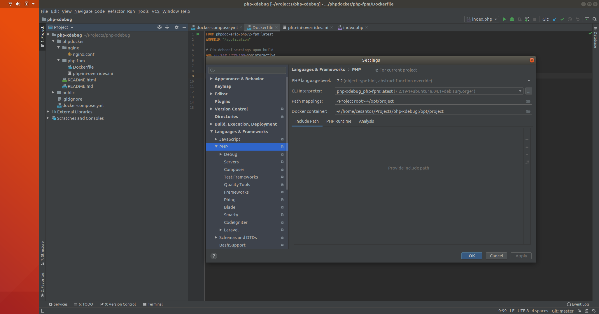
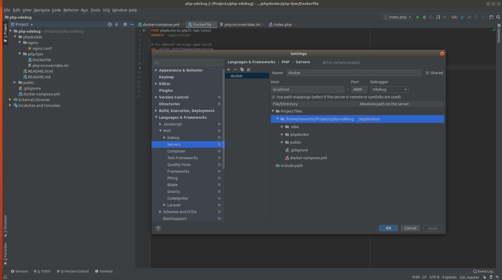

**Instruções**

* Configuração do Interpretador PHP Remoto

* Configuração do servidor remoto e o caminho relativo

* Instalar o plugin do google chrome para escutar a porta do PHPStorm
[XdebugHelper](https://chrome.google.com/webstore/detail/xdebug-helper/eadndfjplgieldjbigjakmdgkmoaaaoc?hl=en)
 